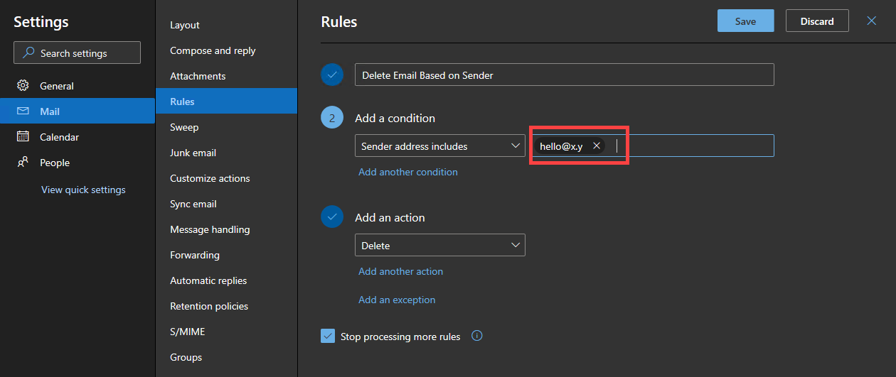

# Exchange Inbox Rule Change Monitor

## Installing the Module

The module is available in PSGallery so you can install it using the `Install-Module ExchangeInboxRuleChangeMonitor` cmdlet.

## Getting the baseline rules

To monitor changes, a baseline rule must be generated first. This will server as the reference set of rules.

You can use the Get-InboxRule cmdlet:

Syntax:

`Get-InboxRule -Mailbox <mailboxID> | Export-CliXML C:\BaseLineRules\<mailboxID>.xml`

Example:


## Checking for changes in existing rules

To get the changes in the rules, compare the baseline rules with the current rules in the mailbox.

Syntax:

`Get-InboxRuleChange -Mailbox <mailboxID> -ReferenceRule <baselinerule>`

Example:


The above example shows no results because no rules were changed from the time the baseline was taken.

If a rule is change and re-run the command, it should return the rule difference. For example, I edited a rule in my mailbox as show below.



Running the command again, a result is returned.


## Creating an HTML Report of changed rules

This module includes a function to output the report in a pre-formatted HTML. However, you are not required to use this if you want to create your own HTML report format.

Syntax:

`Write-InboxRuleChangeHTMLReport -ReportObject <rule_change_report> -Path <path.to.html>`

Example:


The example above used the output of the `Get-InboxRuleChange` cmdlet and passed the object to the `Write-InboxRuleChangeHTMLReport` and the HTML report is saved on `C:\RuleChangeReport\Report.html`


## Checking if rules are added or removed

This module also include a function to check whether a rule is removed or added as compare to the baseline list of rules.

Syntax:

`Get-InboxRuleList -ReferencRules <baseline rules> -CurrentRules <current rules>`

Example:


The example above shows that the rules compared between the baseline and the current are in 'Normal' state, which means that there are no 'Added' or 'Deleted' rules.

This time, delete one rule and create a new rule. Then re-run the check. It should return a different result showing an 'Added' and a 'Deleted' rule.


## Creating an HTML Report of the rules list

This module includes a function to output the report in a pre-formatted HTML. However, you are not required to use this if you want to create your own HTML report format.

Synatx:

`Write-InboxRuleListHTMLReport -ReportObject <rule_list> -Path <path.to.html>`

Example:


The example above created the HTML report in `C:\RuleChangeReport\RulesList.html`

## Sending report to email example

This module does not include a send-to-email function, but if you created an HTML report, you can use the contents of the HTML file as email body. The below helper script may help you with it.

```PowerShell
$credential = Get-Credential #If your SMTP relay requires authentication - which is default with Office 365
$Mailbox = 'june@poshlab.ml'
$ReferenceRule = @(Import-Clixml 'C:\BaseLineRules\june@poshlab.ml.xml')
$ReportObject = Get-InboxRuleChange -Mailbox $Mailbox -ReferenceRule $ReferenceRule
$ReportFile = "C:\RuleChangeReport\Report.html"

Write-InboxRuleChangeHTMLReport -ReportObject $ReportObject -Path $ReportFile

$mailProps = @{
    SmtpServer = 'smtp.office365.com'
    Port = 587
    Credential = $credential
    Subject = "Inbox Rule Change Detected on Mailbox - $($Mailbox)"
    Body = (Get-Content $ReportFile -raw)
    From = 'june@poshlab.ml'
    To = 'june@poshlab.ml'
    UseSSL = $true
    BodyAsHtml = $true
}

Send-MailMessage @mailProps
```

If everything goes well, the email report is sent. See example below:

